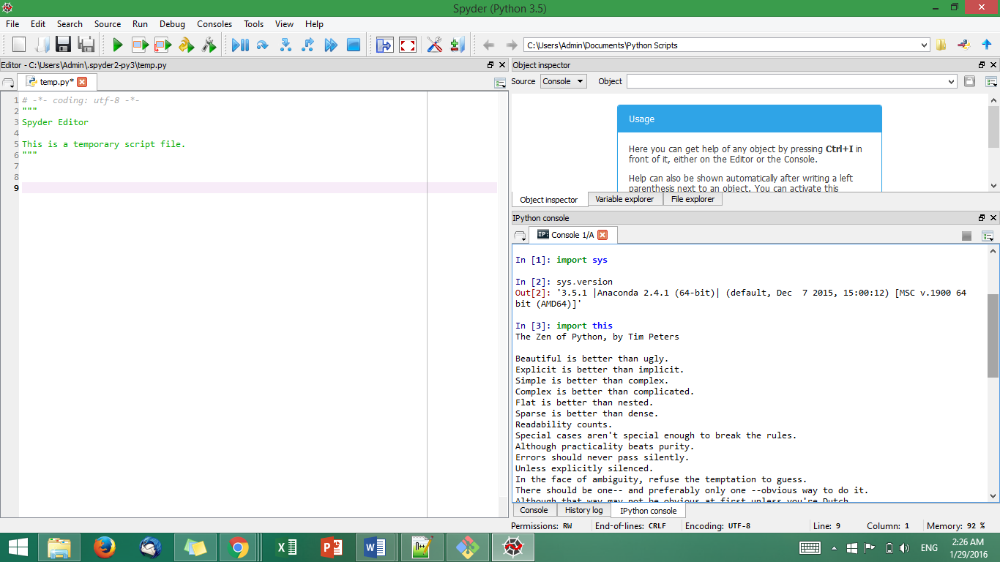

UECM3033 Assignment #1 Report
========================================================

- Prepared by: ** Ng Ann Chee**
- Tutorial Group: T2

--------------------------------------------------------

## Task 1 -- setup a github repository

The reports, codes and supporting documents are uploaded to Github at: 

https://github.com/annchee/UECM3033_assign1

---------------------------------------------------------

## Task 2 -- setup python

Put here the screen shot of file (python.png)

------------------------------------------------------------

## Task 3 -- modify and run Python script

In this section, please report:

1. The hexadecimal value of student ID(1200667) is 0x12521b.
2. Write down the definite integrals.

$$\int_0^{\infty}{e^{-x^2}}{cos x} dx = \frac{\sqrt{\pi }e^{\frac{-1}{4}}}{2}$$    
3. Write down system of 10 linear equations.

\begin{align*}
2 x_0 +3x_1 +5x_2 -2x_3 -3x_4 -6x_5 &= 3, \\
3 x_0 +4x_1 +4x_2 -3x_3 -1x_4 -4x_5 &= -6, \\
5 x_0 +4x_1 +10x_2 +6x_3 -4x_4 +22x_5 &= -170, \\
-2 x_0 -3x_1 +6x_2 +4x_3 +12x_5 -2x_6 +3x_7 +6x_8 &= 0, \\
3 x_0 -1x_1 -4x_2 +2x_4 -3x_6 -x_7 +4x_8 &= -13, \\
-6 x_0 +4x_1 +22x_2 +12x_3 +90x_5 -6x_6 -4x_7 +22x_8 &=0, \\
-2 x_3 +3x_4 -6x_5 +2x_6 -3x_7 +5x_8 +5x_9 &=0, \\
3 x_3 -1x_4 -4x_5 -3x_6 +4x_7 -4x_8 &=-7, \\
6 x_3 +4x_4 +22x_5 +5x_6 -4x_7 +10x_8 +26x_9 &=170, \\
5 x_6 +26x_8 +53x_9 &=0.
\end{align*}

Solution =  [-69.55576514 -12.04762542  39.0859379  -31.63206755  18.00281194
   4.4051637   27.88505428   3.38095875 -48.41274931  21.1189851 ]
-----------------------------------
last modified: 29 Jan 2016
